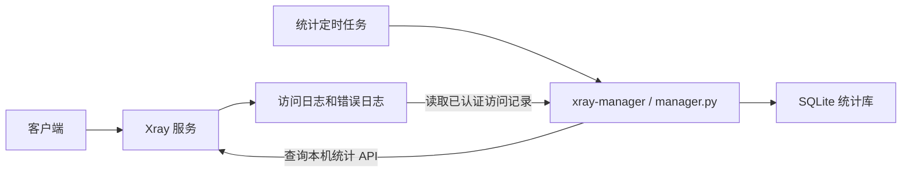

# Xray Manager 结构与文件路径

本文说明项目结构以及安装到 VPS 后的配置、日志、统计和备份位置。安装、客户端连接与升级步骤参阅 [README.md](README.md)。以下路径对应本项目的标准 systemd 安装，仓库默认克隆到 `/root/xray-manager`。

## 仓库结构

```text
/root/xray-manager/
├── README.md                    # 安装、升级和日常使用说明
├── xray-README.md               # 项目结构与服务器文件路径（本文）
├── deploy-xray.sh               # 首次安装或显式重装
├── upgrade-xray.sh              # 保留现有账号与配置的原地更新
├── manager.py                   # 管理程序源码
├── tests/
│   ├── test_deploy.py           # 安装地址探测、手动覆盖和失败处理测试
│   ├── test_manager.py          # 交互菜单、并发锁和统计测试
│   └── test_upgrade.py          # 隔离环境中的升级与回滚测试
├── .github/workflows/check.yml  # GitHub 自动语法检查和测试
├── .gitignore                   # 排除凭据、运行数据和备份
└── .gitattributes               # 保持脚本等文本文件使用 LF 换行
```

仓库中的 `manager.py` 是源码；实际运行的是安装到 `/usr/local/lib/xray-manager/manager.py` 的副本。`git pull` 更新仓库文件，执行 `upgrade-xray.sh` 后才会更新已安装的管理程序；设置 `VERSION` 时还会更新 Xray 内核。

## 运行结构



- `xray.service` 使用专用 `xray` 用户运行内核，读取服务端配置，处理代理连接并写日志。
- `xray-manager` 是命令入口，调用 Python 管理程序；在交互终端中不带参数打开数字菜单，非交互环境中不带参数输出帮助。管理操作要求 root 权限，原有子命令仍可用于脚本。
- `xray-stats.timer` 每约 60 秒触发 `xray-stats.service`，执行 `xray-manager collect`。
- 管理程序通过只监听本机的统计 API 读取计数器，同时解析访问日志，将流量增量和已认证来源 IP 历史写入 SQLite。

## 程序与配置文件

| 路径 | 用途 |
|---|---|
| `/usr/local/bin/xray` | Xray 内核可执行文件 |
| `/usr/local/bin/xray-manager` | Shell 命令入口，调用下方的 Python 程序 |
| `/usr/local/lib/xray-manager/manager.py` | 实际运行的管理与统计程序 |
| `/usr/local/etc/xray/config.json` | Xray 服务端主配置 |
| `/var/lib/xray-manager/connection.json` | 生成客户端导入链接所需的服务器地址与 REALITY 公钥 |

`config.json` 包含代理与统计 API 入站、设备账号 UUID/email/flow、REALITY 私钥与 shortId、统计策略、出站及路由规则。配置文件所有者为 `root:xray`，权限为 `640`，Xray 服务用户可以读取。

`connection.json` 包含 `server` 和 `public_key` 两个字段，管理程序将它与主配置一起用于生成 `vless://` 链接。安装时 `server` 默认自动探测公网 IPv4，也可通过 `SERVER_IP` 手动指定 IPv4 或域名；这个字段用于客户端连接地址，不改变 Xray 的 IPv4 监听地址。它位于仅 root 可访问的状态目录中。

修改主配置后，在 VPS 上先校验，再通过管理命令重启：

```bash
runuser -u xray -- /usr/local/bin/xray run -test -config /usr/local/etc/xray/config.json
xray-manager restart
```

查看客户端链接：

```bash
xray-manager share
```

主配置、导入链接和备份含访问凭据，应保存在 VPS 或本地私有位置。

## 日志位置

| 路径 / 来源 | 内容 |
|---|---|
| `/var/log/xray/access.log` | 访问记录，包含来源地址、目标地址及已认证账号 email |
| `/var/log/xray/error.log` | Xray 运行时警告和错误，默认日志级别为 `warning` |
| `journalctl -u xray` | systemd 保存的 Xray 启动、退出和标准输出/错误信息 |
| `journalctl -u xray-stats.service` | 统计采集任务的执行结果和错误信息 |
| `/etc/logrotate.d/xray` | Xray 日志轮转规则 |

```bash
# 访问与运行错误日志
tail -n 50 /var/log/xray/access.log
tail -n 50 /var/log/xray/error.log
tail -f /var/log/xray/error.log

# 服务启动失败或统计任务异常
journalctl -u xray -n 100 --no-pager
journalctl -u xray-stats.service -n 50 --no-pager
```

日志目录由 `xray:xray` 持有，日志文件权限为 `640`。服务通过 systemd drop-in 设置 `TZ=UTC`，访问记录及统计时间使用 UTC。systemd 日志通过 `journalctl` 查询，其实际磁盘存储位置由服务器的 journald 配置决定。

日志轮转按日检查，规则设置 `maxsize 20M`，保留 7 份旧日志并压缩，轮转文件也位于 `/var/log/xray/`。`copytruncate` 在复制和截断期间可能丢失少量日志；轮转前先采集，轮转后重置读取游标。

## 统计数据与锁文件

| 路径 | 用途 |
|---|---|
| `/var/lib/xray-manager/stats.sqlite3` | 持久化流量和来源 IP 历史的 SQLite 数据库 |
| `/var/lib/xray-manager/manager.lock` | 管理命令互斥锁，防止并发采集或账号修改 |
| `/var/lib/xray-manager/upgrade.lock` | 升级脚本互斥锁，防止同时执行多个升级 |

`manager.lock` 仅在单次操作期间持有。菜单等待输入、确认和返回时已释放锁并关闭数据库连接，后台统计可继续执行。采集与设备修改保持互斥，增删设备的配置读取、校验、保存和重启在同一锁内完成；服务状态和服务日志查询不获取此锁。

状态目录 `/var/lib/xray-manager` 权限为 `700`，仅 root 可访问。数据库内部结构：

| 表 | 保存内容 |
|---|---|
| `counters` | 每个流量计数器的服务启动标识、上次值和累计总量 |
| `traffic` | 每次采集的时间、计数器名称和字节增量 |
| `sources` | 已认证访问的时间、来源 IP 和账号名 |
| `cursors` | 访问日志的文件标识和已读取偏移量 |

累计总量长期保留，分时流量及来源 IP 记录保留 90 天。流量按设备账号统计，来源 IP 是访问历史，不能将每个字节精确分配到来源 IP。

```bash
xray-manager stats       # 持久化累计流量
xray-manager stats 7     # 最近 7×24 小时的采样流量
xray-manager ips         # 已认证来源 IP 历史
xray-manager online      # 当前已建立的代理 TCP 连接
```

## systemd 文件位置

| 路径 | 用途 |
|---|---|
| `/etc/systemd/system/xray.service` | Xray 服务，定义运行用户、启动命令及权限限制 |
| `/etc/systemd/system/xray.service.d/timezone.conf` | 设置 Xray 日志使用 UTC |
| `/etc/systemd/system/xray-stats.service` | 执行一次 `xray-manager collect` 的采集任务 |
| `/etc/systemd/system/xray-stats.timer` | 每约一分钟触发采集任务 |

```bash
xray-manager status
systemctl status xray xray-stats.timer --no-pager
systemctl show xray-stats.service -p Result -p ExecMainStatus
```

Xray 正常运行时显示 `active (running)`，统计 timer 显示 `active (waiting)`。统计 service 是一次性任务，完成后显示 `inactive (dead)` 属于正常情况，应结合 `Result=success` 和 `ExecMainStatus=0` 判断。

## 备份位置

| 路径 | 产生时机与内容 |
|---|---|
| `/var/lib/xray-manager/config-*.json` | 增删设备前保存的主配置备份 |
| `/var/lib/xray-manager/upgrade-*` | 原地升级前的备份目录，包含旧 `xray`、`manager.py`、`config.json`、`connection.json` 和 SQLite 在线备份 |
| `/root/xray-backup-*` | 显式重装前保存的旧安装配置、服务文件、内核及状态目录等 |

这些备份不会自动按 90 天统计保留策略清理。可使用交互菜单的“备份管理”或 `xray-manager backups` 查看列表，`xray-manager backup-info PATH` 查看文件详情，`xray-manager delete-backup PATH --yes` 删除指定备份；菜单删除需要确认。也支持 `/root/xray-stats-backup*.sqlite3` 和 `/root/xray-config-backup*.tar.gz` 手动备份。

详情显示文件元数据，不输出配置或密钥内容，也不展开归档。删除仅接受识别的备份路径，拒绝符号链接入口；删除期间先获取 `upgrade.lock`，再获取 `manager.lock`，与升级脚本使用相同顺序，正在升级时拒绝删除。选择与确认期间不持有锁。

升级失败时，升级脚本自动恢复旧程序；恢复时沿用当前配置和统计库。人工备份 SQLite 应使用在线备份接口，具体命令见 [README.md 的备份章节](README.md#备份)。
